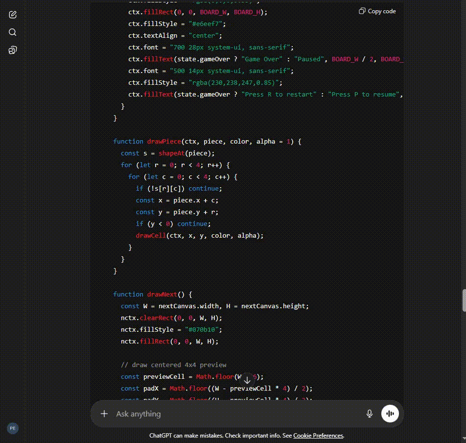

# Souls Copy / Paste Overlay

A Chrome extension that displays a **Dark Souls–style fullscreen overlay**
whenever you press **Ctrl/Cmd + C** or **Ctrl/Cmd + V** — complete with
dramatic red text, sound effects, and combo chaining.

> Because copying text should feel dangerous.

---

## Features

- Fullscreen dark transparent overlay
- Souls-style red text
- Ctrl/Cmd + C → funny “copy” messages
- Ctrl/Cmd + V → funny “paste” messages
- Sound playback (user-provided)
- Combo system (`COPIED ×3`, `×4`, etc.)
- Click anywhere or press **Esc** to dismiss
- Customizable phrases, timing, volume

---

## Installation (Developer Mode)

1. Clone or download this repository
2. Open Chrome and go to `chrome://extensions`
3. Enable **Developer mode** (top-right)
4. Click **Load unpacked**
5. Select the project folder

---

## Adding Your Own Sound (Required)

This repository **does not include any audio files**.

To enable sound playback:

1. Create the folder if it doesn’t exist:
sounds/

csharp
Copy code

2. Add your own sound file, for example:
sounds/souls_chime.mp3

css
Copy code

3. Open the extension’s **Options** page in Chrome and make sure the
sound file path matches:
sounds/souls_chime.mp3

yaml
Copy code

4. Reload the extension from `chrome://extensions`

> ⚠️ Use audio you **own the rights to** or that is **royalty-free / CC0**.

The extension uses Web Audio and can automatically **sync the overlay
duration to the audio length**.

---

## Configuration

Open the extension’s **Options** page to:

- Change copy/paste phrases
- Adjust volume
- Sync overlay duration to audio length
- Control combo timing and limits
- Enable or disable key-repeat handling

---

## Controls

- **Ctrl/Cmd + C** → Copy overlay
- **Ctrl/Cmd + V** → Paste overlay
- **Click anywhere** → Dismiss overlay
- **Esc** → Dismiss overlay

---

## Legal / Disclaimer

- This project is **not affiliated with or endorsed by FromSoftware**
- No Dark Souls assets (fonts, sounds, textures) are included
- All visuals are original or system-based

---

## License

MIT
